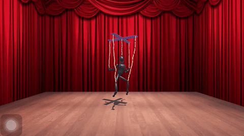

# Marionette-Control
This is a project from my Fall 2016 semester, CS6323 Computer Animation and Gaming course.

###Description
In this application, I performed a landscape stage of puppet performance on iOS device, provided controlling of puppet with rotation of its control bar, whose input is from accelerometer and touching on the device. The program was written in Unity and [built](https://unity3d.com/cn/learn/tutorials/topics/mobile-touch/building-your-unity-game-ios-device-testing) into iOS device.

#####Here is how the puppet being controlled by accelerometer input from iOS device.

#####Here is how the puppet being controlled by swiping gesture on device screen.

